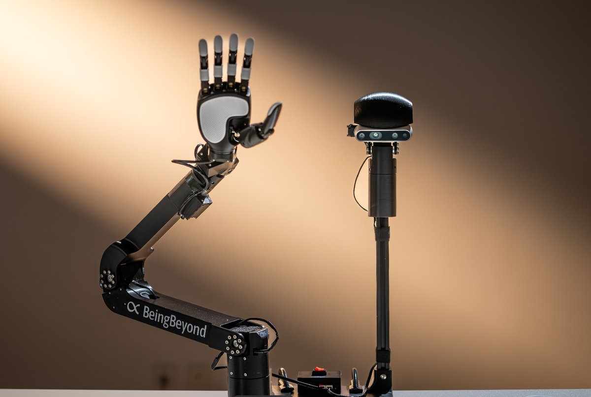

# robot-beingbeyond-d1

*[中文版](./README_CN.md)*

`robonix.robot.beingbeyond.d1` — Robonix whole-robot deployment for the BeingBeyond
D1 desktop robot: a fixed-base 6-DOF arm, a 2-DOF head pan/tilt, a five-finger
dexterous hand, and a head RGB-D camera.

The centrepiece is the **object pick-and-place skill** (`vertical_grasp_object`,
8 MCP tools), plus a `hand_gesture` skill. Both are driven through pilot, either
from `rbnx chat` (text) or over the voice pipeline.



## Capabilities

| Tool | What it does |
|---|---|
| `detect_objects(instruction)` | Open-vocabulary VLM detection from a natural-language description (colour / shape / text / spatial relation). Returns a base-frame grasp point and grasp yaw. **Preferred in general** |
| `detect_cubes(class_filter)` | YOLO-OBB detection of coloured cubes (red/blue/green/yellow), same schema. **Preferred for cubes**, and the fallback when no VLM is configured |
| `pick_cube(position, angle_deg, gripper)` | Move to a position, grasp at the given yaw / tightness, keep holding |
| `place_cube(position, angle_deg, gripper)` | Move to a position and release; `z` sets the stacking height. Parks out of the camera's view on success |
| `stack_cubes(top_color, base_color, gripper)` | One call for "stack A on B": detect → pick → place. **Preferred for stacking** |
| `put_cube_in_container(color, gripper)` | One call to drop a cube of the given colour into the fixed container spot |
| `sort_cubes(gripper)` | One call to sort every cube on the table into its colour's fixed spot |
| `verify_grasp(instruction, mode, position)` | VLM re-check of whether a pick / place landed — the basis for closed-loop retries |
| `gesture_dance(duration_s)` | Make the dexterous hand dance, then leave it open |

`position` is base-frame metres as `"x,y"` / `"x,y,z"`, or a named location. Both
ASCII and full-width commas are accepted. Detection geometry runs through the
hand-eye homography plus a perspective correction; depth is the fixed table Z
(neither detector uses the RealSense depth stream).

## Platform and hardware inventory

**Compute platform**: x86_64, WSL2 / Ubuntu 22.04 on a Windows 11 host, native
(not containerised). **No ROS 2** — every primitive talks to the vendor SDK
directly and serves its capabilities over gRPC, so no `topic_out` streaming
contracts are provided. Python 3.10 (conda env `bb_d1_robonix`). Verified against
Robonix commit `8c0baca2e9f95c334b9ef078419c7bd20739bac7` (2026-07-20).

**Hardware and connections**:

| Device | Model | Connection |
|---|---|---|
| Arm + head pan/tilt | BeingBeyond D1 (6 + 2 DOF) | serial `/dev/ttyUSB0` @ 1000000 (**arm and head share this one port**) |
| Dexterous hand | Linker five-finger, six-axis | CAN `can0` @ 1000000 |
| Head camera | Intel RealSense D435i | USB 3.0, 1280x720@30 |
| Mic / speaker | Windows host devices | via WSLg's PulseAudio `pulse` device |

**Frames**: one whole-robot URDF (`urdf/robot_right_hand.urdf`), root link
`link_base`, with the arm chain and the head chain branching off it and the camera
frame named `camera`; every fixed transform lives in that tree. Fixed-base
deployment with no ROS 2, so there is **no TF publisher** — the pixel→base
transform is done by the hand-eye homography inside the skill, and
`handeye_calib.npz` is the single source of truth for that chain.

**Safety boundaries**:

- **There is no software e-stop.** Only hardware power-off / a physical e-stop.
  Verify the hardware e-stop independently halts arm and hand before any motion.
- Joint limits come from the controller firmware and the URDF. `move_pose` only
  commands a pose when IK converges within `ik_pos_tol` (default 0.05 m),
  otherwise it errors without moving.
- Bus permissions: serial needs `chmod 666 /dev/ttyUSB0` or `dialout` membership;
  CAN is brought up by DexHand at init (when not root, bring the interface up
  beforehand or export `PREFLIGHT_SUDO_PASS`).
- Watchdog: every provider stops hardware output and releases the serial link on
  input timeout, process exit, or `CMD_SHUTDOWN`.
- A `pick_z` set too low presses the fingers into the table. For the hand's first
  open/close, lower the torque ceiling with `set_joint_torque_limits`. The skill
  does no collision checking.
- The footprint in `soma.yaml` is the base mounting outline only (0.20 m square),
  **not a drivable area**; the arm's dynamic envelope is not in a static footprint.

## Deployment composition

| Kind | Instance | Package | Source |
|---|---|---|---|
| primitive | `d1_arm` | `robonix.primitive.beingbeyond.d1.arm` | [primitive-beingbeyond-d1-arm-rbnx](https://github.com/Ciliphen/primitive-beingbeyond-d1-arm-rbnx) |
| primitive | `d1_hand` | `robonix.primitive.beingbeyond.d1.hand` | [primitive-beingbeyond-d1-hand-rbnx](https://github.com/Ciliphen/primitive-beingbeyond-d1-hand-rbnx) |
| primitive | `d1_camera` | `robonix.primitive.beingbeyond.d1.camera` | [primitive-beingbeyond-d1-camera-rbnx](https://github.com/Ciliphen/primitive-beingbeyond-d1-camera-rbnx) |
| primitive | `audio_driver` | `robonix.primitive.audio.alsa` | [primitive-audio-driver-rbnx](https://github.com/syswonder/primitive-audio-driver-rbnx) |
| service | `speech` | — | `${ROBONIX_SOURCE_PATH}/services/speech` (built into robonix) |
| skill | `vertical_grasp_object` | `robonix.skill.vertical_grasp_object` | [skill-vertical-grasp-object-rbnx](https://github.com/Ciliphen/skill-vertical-grasp-object-rbnx) |
| skill | `hand_gesture` | `robonix.skill.hand_gesture` | [skill-hand-gesture-rbnx](https://github.com/Ciliphen/skill-hand-gesture-rbnx) |

This repo does **assembly and robot-specific config only**: the manifest,
soma/urdf, offline tools, and the detection assets. Every driver and skill lives
in its own repository and is fetched by the manifest's `url:` + `branch:` into
`rbnx-boot/cache/<repo-name>/`. Each package's capability table, config fields,
and safety notes are in its own README.

Changing package code therefore means: edit in the package repo → push → here run
`rbnx clean -f robonix_manifest.yaml --cache` → `rbnx build` again.

## Layout

```
robot-beingbeyond-d1/
├── robonix_manifest.yaml   # deployment manifest: system components + voice + 4 primitives + speech + 2 skills
├── soma.yaml               # D1 body model (urdf.path → ./urdf/)
├── .env.example            # VLM + Tencent Cloud TTS credential template (copy to .env)
├── assets/                 # robot.jpg (catalog preview) + bb_d1.png (source image)
├── models/                 # detection assets: best.pt + handeye_calib.npz (robot-specific, git-ignored)
├── urdf/
│   ├── robot_right_hand.urdf   # whole-robot URDF (for soma / IK), root link = link_base
│   └── meshes/                 # STLs referenced by the URDF (incl. right_hand/)
└── tools/                  # offline tools, not part of the deployment
    ├── func_verify/        # D1 SDK self-check samples (separate env bb_d1_rbnx, see its README)
    ├── yolo_train/         # cube-detection labelling + training chain; copy best.pt into models/
    ├── arm_calibration/    # hand-eye calibration / sag compensation; produces handeye_calib.npz
    └── vision.py           # RealSense capture helper
```

The skills are pure robonix **consumers**: `on_activate` discovers the primitives
through atlas and drives them over their gRPC contracts; they never open the
serial link / CAN bus / RealSense themselves. IK/FK, YOLO, and the hand-eye
projection are local pure compute.

## Voice

`rbnx boot` brings up the voice pipeline: `audio_driver` (under WSLg the mic and
speaker go through the PulseAudio `pulse` device — WSLg has no real sound card, so
`arecord -l` is empty and the device MUST be set explicitly to `pulse`) plus the
`speech` service.

- **ASR**: the `custom` backend forwards 16k/mono/pcm_s16le to an **external**
  PaddleSpeech streaming WebSocket (`PADDLE_ASR_PORT=8090`; leaving the host unset
  resolves to the WSL gateway = the Windows host, so a WSL restart changing the IP
  does not matter).
- **TTS**: Tencent Cloud TextToVoice (`voice_type=1001`, the basic zhiyu voice),
  returning 16 kHz mono pcm_s16le that the speaker primitive plays directly.
  Export `TENCENTCLOUD_SECRET_ID` / `_SECRET_KEY` in the operator shell.

Picking the `custom` backend also keeps `rbnx build` from pulling in
Torch/CUDA/FunASR/Whisper.

## Deploy and run

Prerequisites: a Python 3.10 env `bb_d1_robonix` (`ultralytics` + the robonix/mcp
deps, plus
`pip install tools/func_verify/lib/beingbeyond_d1_sdk-0.2.0-cp310-*.whl` — the
wheel ships in this repo and is `cp310` + `manylinux_2_17_x86_64`, so the env has
to be Python 3.10 / x86_64); the `d1_arm` / `d1_hand` / `d1_camera` hardware
connected with bus permissions in place; the YOLO weights and hand-eye calibration
in `./models/` (`best.pt` + `handeye_calib.npz`, see that dir's README), and
`D1_DEPLOY_DIR` in the manifest's `env:` pointing at this repo's real path. For
voice, start the external PaddleSpeech ASR service first.

```bash
cp .env.example .env && $EDITOR .env    # VLM endpoint + Tencent Cloud TTS credentials
set -a && . ./.env && set +a            # export into the shell (the manifest expands ${VAR})
rbnx setup "$PWD"                       # register ${ROBONIX_SOURCE_PATH}
rbnx build -f robonix_manifest.yaml     # fetch the url: packages, then codegen each (--mcp for skills)
rbnx boot -v -f robonix_manifest.yaml   # foreground; logs go to rbnx-boot/logs/
```

Acceptance, from a second terminal:

```bash
rbnx caps -v          # 4 primitives + speech ACTIVE; the 2 skills INACTIVE (expected)
rbnx logs -d ./rbnx-boot/logs -l warn
rbnx chat             # e.g. "stack the red cube on the blue one" / "sort the cubes by colour"
rbnx shutdown -f robonix_manifest.yaml
```

Skill-kind packages staying `INACTIVE` is per spec — the executor fires
`CMD_ACTIVATE` on the first MCP call. The `rbnx build` summary should read
`Failed: 0` / `Skipped: 0` with `Built` equal to the manifest's instance count (7).

**Do not start from motion on a new robot**: run the read-only paths first
(`d1_camera` snapshot, `arm/get_state`, `detect_objects` / `detect_cubes`), confirm
the returned coordinates, timestamps, and frames look right, then add the motion
instances back one at a time to verify single joints, finger open/close, and the
e-stop.

## Notes

- Grasp height `pick_z`, cube height `block_height`, `table_z_offset`, asset paths,
  the VLM endpoint, `grasp_feedback` and friends are tuned in the skill's `config:`
  block in `robonix_manifest.yaml`. Field semantics live in each package's
  `config.spec`; call semantics in the skills' `CAPABILITY.md`.
- `detect_objects` / `verify_grasp` need an OpenAI-compatible VLM endpoint
  (`VLM_BASE_URL` / `VLM_API_KEY` / `VLM_MODEL`). Without it those two tools are
  unavailable and the other six keep working.
- The hand-eye calibration is tied to the camera mount and the table height —
  re-calibrate if the head camera is remounted or the table height changes.
- Everything under `tools/` is offline and takes no part in `rbnx boot`.
  `tools/func_verify/` uses its own env `bb_d1_rbnx` to talk to the SDK directly
  for hardware self-checks, independent of the `bb_d1_robonix` deployment env.

## License

MulanPSL-2.0
